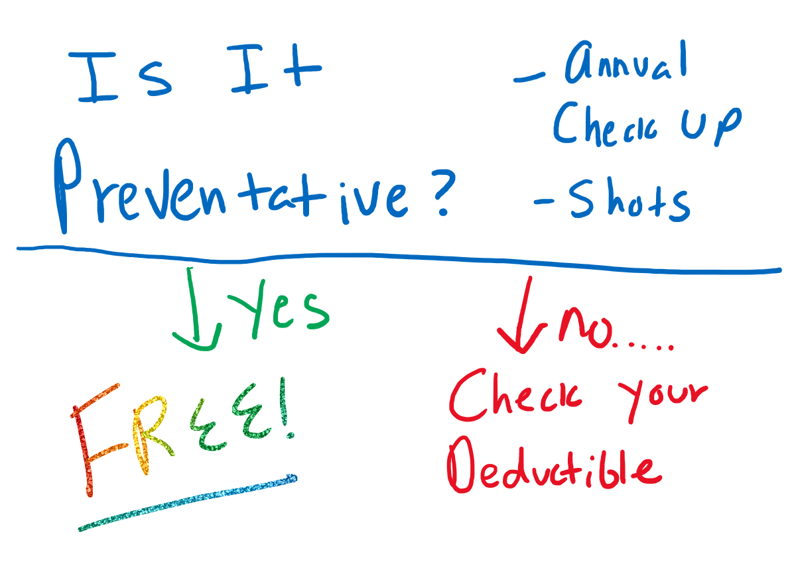
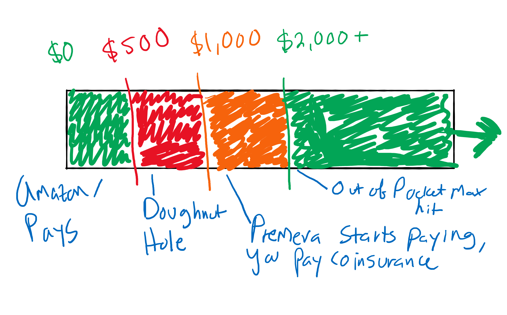

Amazon's shared deductible plan is both good health-care and cost efficient. As of 2020, It's $31/month for an individual, and the effective deductible is $500/year. 

However, it is complicated. 

This plan is offered by both Premera and Aetna. It's administered in similar ways by both plans. I have Premera, so I'll use that in the explanation. 

## Preventative Expenses

We are about to get into a complex discussion of deductibles and out of pocket expenses. 

Preventative care ignores all of this. Preventative care is always covered by your insurance. On Amazon's plan, there is *no charge* for preventative care, screenings, and immunizations. In other words, if you are feeling healthy, it's free. 

However, if you get diagnosed with a medical problem (e.g., injury, sickness, disease) then you have to pay according to the deductibles as explained below. 

If you go into the doctor with a problem, that's not preventative care, and you will have to pay. 

## Shared Deductible Components

### 1: Premera Deductible 

The underlying plan from Premera has a deductible of $1000. This means that, after you have $1000 in medical expenses, Premera will start helping cover part of the costs. 

Note that only expenses approved by Premera count towards this total. If you are at a medical facility *in network* with Premera, you don't have to worry about this. They are responsible for making sure everything they do is approved by Premera. 

Note that some medical providers may *accept* Premera, but not be *in network*. They may be *not contracted* with Premera. It's important to ask about this, and be wary of vague answers. 

Just to be clear, before you have $1,000 in health expenses (including prescriptions), Premera won't contribute towards the cost.

However, Amazon will. 

### 2: Amazon Reimbursement Account 

To help with this deductible, Amazon provides a special funding source called a Health Reimbursement Account. Amazon contributes $500 into this account each year. 

Premera automatically uses this money to pay for your first $500 in medical expenses. In other words, Amazon pays the first *half* of your deductible. 

Consider that Premera's $1000 deductible is offset by the $500 from Amazon. In effect, you are only responsible for the "doughnut hole" area, where you have run out of money in the reimbursement account, and you haven't yet met the Premera deductible. Or, dollars $501 to $1000. 

It's important to note that this money rolls over each year. Amazon just adds $500 each year. 

### 3: Out of Pocket Maximum

Sadly, It gets more complicated. 

Additionally, after you meet your deductible, Premera starts paying, but doesn't pay all of your medical expenses. 

After your $1,000 deductible, Premera pays 90% until you hit your *out of pocket maximum*. 

The out of pocket maximum is $2,000 for an individual. This is a safeguard, and means that you will not have to pay more than $2,000 for medical expenses in a plan year. As long as those medical expenses are approved (e.g., in network) with Premera. 

After your the amount Premera expects you to contribute hits $2,000, they have to pay 100% of your covered medical expenses.

$1,532,000 for an organ transplant at an in-network hospital? Your portion of the bill will be $2,000 -- assuming you haven't paid any other medical bills that year.

Don't forget about the $500 from Amazon! So that $2,000 out of pocket maximum is really $1,500. 

## Plan Year

### Default

The deductible resets on the first day of your new plan year. 

At Amazon, the plan year starts on April 1st. 

Also, on the first day of the new plan year you get access to the *full amount* of the health reimbursement account.

### New Employees

Let's consider what happens when you join Amazon in the middle of the plan year.

If you join in August, that's 1/3rd through a plan year (4 months). 

Since you will only be part of the plan for 2/3rds of the normal time, this factor is used to adjust the plan values. 

- Reimbursement Account = $333 = 500 * 2/3
- Total Premera Deductible = 666 = 1000 * 2/3

- Your portion of the deductible is $333.  

You can calculate these values similarly using the month you started in. 

### Departing Employees

First, all claims up until your last day of coverage are processed normally. You will be notified of your last day of coverage. You can pay to extend your last day of coverage, using COBRA. 

Then, you lose all the money in the reimbursement account. 

## Implementation

This account is a lot to manage. 

You have three accounts to keep track of. I think of them like progress bars. 

1. Amazon Reimbursement Account - access via link from Premera
2. Premera Deductible 
3. Premera Out of Pocket Maximum 

You could also have a flex spending account (FSA). That is separate from all this. 

### Flex Spending Accounts

You may have heard of a Flex Spending Account (FSA). It's separate from the reimbursement account.

FSAs are complicated. You put your own money in it. If you don't spend it, you risk losing it. 

It's worth researching if you have medical expenses that are out of network, or that aren't covered through big health organizations.

For example, if you see a private mental health therapist, and you pay cash, consider a FSA.

## Discussion

American health care is complicated.

👍 Amazon prioritized being frugal and providing good health-care. 

👎 The downside is complexity.

The plan is only $31/month, but you get $500 tax-free to spend on health-care. 

Have less than <$500 in medical expenses in a year? You keep the money. You could easily build up $2,000 in the account over a few years. If you then had a major medical incident, your account could cover your out of pocket expenses completely. 

This plan is great for healthy (e.g., young) people, who may experience an acute illness or accident. For example, if you have minimal annual expenses, but also want protection if something big happens.

This plan is ok if you have consistently high medical expenses. For example, if you have genetic diabetes.  

## To Do
- evaluate the scope of this document, identify some areas that are out of scope
- change style of key terms, maybe underline?
- the hand drawn diagram was a neat idea, but is it clear?

