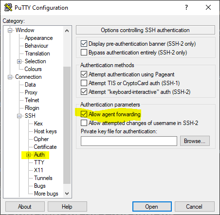

Microsoft makes it suprisingly easy to create and use a hardware SSH key (i.e., RSA key). 

## Virtual Smart Card
Smart cards are commonly used to store secret keys in hardware, where they can't be exported. However, few laptops have smart card readers. 

Most computers do have a TPM (trusted platform module), which can be used to implement a virtual smart card. The virtual smart card lives within the secure element, and only encrypts/signs data in response to a pin. The pin entry interface is provided by windows, and is (hopefully) secure. 

Shockingly, it's one command to create a virtual smart card reader and the associated card. 

```
tpmvscmgr.exe create /name VirtualSmartCard /pin PROMPT /adminkey random /generate /attestation AIK_AND_CERT
```

[Microsoft Docs on tpmvscmgr.exe](https://docs.microsoft.com/en-us/windows/security/identity-protection/virtual-smart-cards/virtual-smart-card-tpmvscmgr)

## Self Signed Certificate
Now we have a virtual smart card, but it's blank. 

Normally, windows requires a whole mess of active directory servers, configured certificate self enrollment policies, certificate requests. 

However, we're fine with a "self-signed" certificate. We just want the public key. Make sure to customize the name in the command below.

```
New-SelfSignedCertificate -Subject "CN=Gilroy Atkins" -KeyAlgorithm RSA -KeyLength 4096 -Provider "Microsoft Smart Card Key Storage Provider"
```

[Microsoft Docs on New-SelfSignedCertificate](https://docs.microsoft.com/en-us/powershell/module/pkiclient/new-selfsignedcertificate?view=win10-ps)

## Putty-CAC
Now we have a key pair on the virtual smart card. Let's put it to use. 

Putty-CAC is designed to use the native windows APIs for interacting with (physical) smart cards. CAC refers to the smart card standard used for authentication in the federal governmetn. 
[Github Releases for Putty-CAC](https://github.com/NoMoreFood/putty-cac/releases)

Launch Pageant, and choose "Add CAPI Cert", select your certificate and enter the pin.

The public key associated with the smartcard is now loaded into the putty agent. To get the base64 text of the public key, click "copy to keyboard". This is what you need for github or the authorized keys file. 

Use the CAC flavor of putty to SSH into hosts, and it will automatically use the hardware SSH key where appropriate. 

## Enable SSH Agent Forwarding

It's common to edit git repos in SSH sessions. Communicating with the git server (e.g., github) can be done with HTTPS or SSH. If you have your git repo URL as a SSH connection (doesn't start with HTTPS), then push operations will be done as a seperate SSH session.

So, it's common to connect to a second remote host from a first remote host.

`Your Computer -> Remote Host One -> Remote Host Two`

Agent forwarding means that, when connecting to the second remote host, an authentication agent (i.e., Pageant) from your computer can be used. This is in contrast to using a SSH key stored on remote host one to connect to the second remote host. 

It's complicated, but a simple option to enable in putty. 

Overall, just make sure you have all the keys on your local computer, and enable forwarding. 




## Integration with windows features

Windows OpenSSH implements the SSH client used by both Windows Terminal (new command prompt) and VS Code SSH Remote Development Extension. 

Windows OpenSSH can be configured to use Pageant, and thus your hardware key. 

Similarly, the OpenSSH client under Windows Subsystem for Linux (thin linux VM on windows) can be configured to use Pageant. 

Check out the [WSL SSH Pageant github repo.](https://github.com/benpye/wsl-ssh-pageant)
