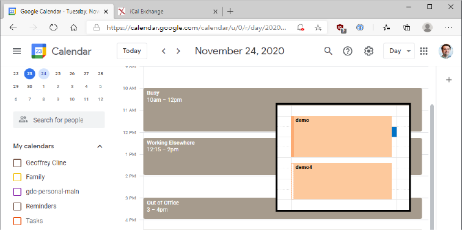
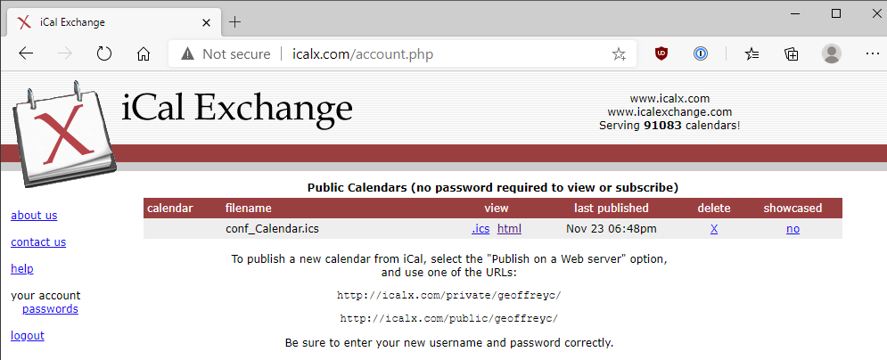
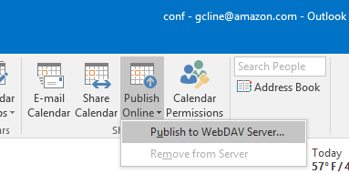
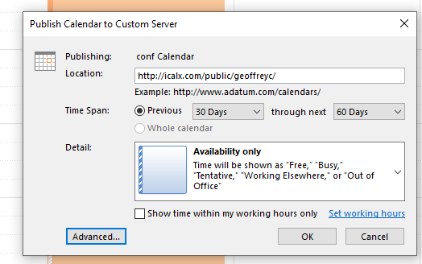
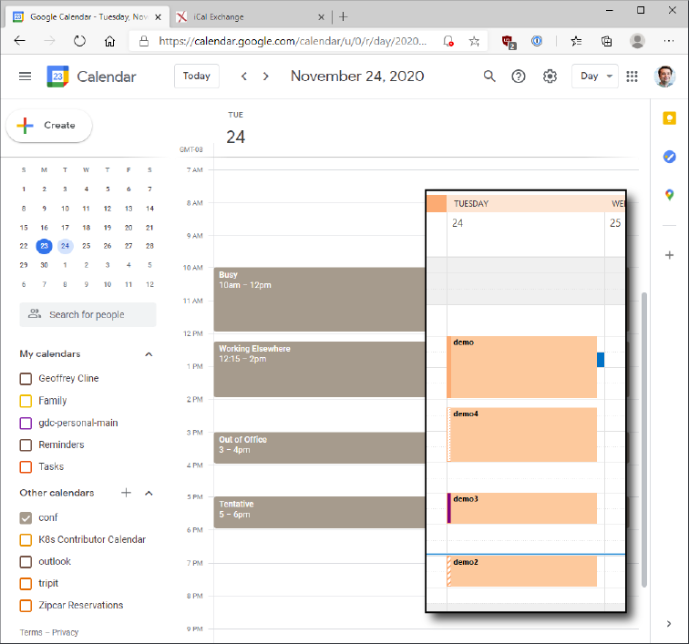

I publish my work Outlook calendar at a public iCal URL. This works great for automations and services, such as Google Calendar and IFTTT. It's also a great way to share your information family, who need to know your availability. 

This is a *fundamentally insecure* way to share information. However, you can configure the Outlook desktop app to only publish free/busy information, so the sensitive details from your calendar aren't exposed. 

## Sign up for iCalX Account

🚩 iCalX does not use HTTPS - use a randomly generated password

1. Sign up at http://icalx.com/ then login

1. Note your new *public* publish URL base `http://icalx.com/public/<USERNAME>/`

🚩 Calendars published as public to iCalX do not require authentication to access. They are freely on the internet. 

## Publish from Outlook

📝 Requires Microsoft Outlook Desktop App on Windows

🚩 Microsoft Outlook must be running to push calendar changes to iCalX. By default, it pushes updates every ~15 minutes. It's fine to make changes on your phone, and then expect Outlook will later sync them from the desktop app. 

1. Naviate to calendar you want to share

1. Select "Publish Online" > "Publish to WebDAV Server..."

1. Paste in iCalX URL base

1. Select level of data to publish. Read the descriptions. 

1. Click "OK" then enter your iCalX username and password. 

## Preview on iCalX 

1. Return to iCalX account page, and refresh

1. Click on HTML URL to preview calendar online. Don't worry if the times are incorrect, it previews using GMT. 

1. Copy .ics url for published calendar. This is the end result you need for other apps, such as Google Calendar or IFTTT. 

## Import to Google Calendar

1. Open Google Calendar, Click "+" icon by "Other calendars" then choose "From URL"

1. Paste in your public url. Google Calendar does not support authentication. 

1. You can now view this outlook calendar from google, and share with other google users. 

## Further Considerations

### Additional Clients
These clients support reading the .ics url:
- Fantastical
- iOS (also supports private, authenticated mode)
- Readdle Calendar
- Users on other Microsoft Exchange Servers 

### HTTPS Proxy
It's possible to make a HTTPS proxy to view the calendar. 

However, I've had difficulty putting a HTTPS proxy around the CalDAV publishing. I would like to protect my iCalX credentials from sketchy wifi networks while traveling. 