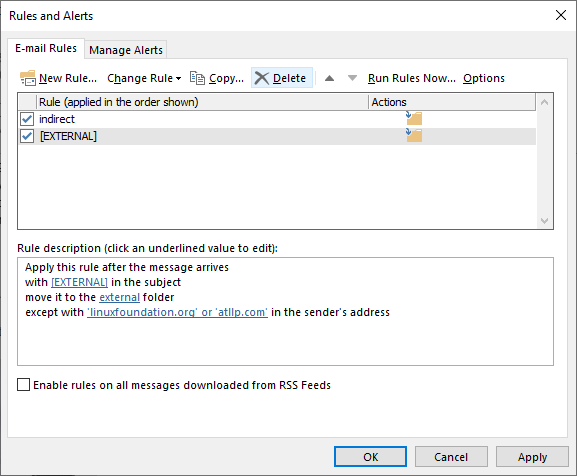
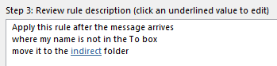
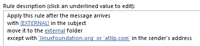

The deluge of notifications I receive from slack reminds me to be thankful for Outlook's robust rules system. The user interface is clunky, but it's a powerful way to wrangle your inbox. I'll describe both creating outlook rules, and some patterns I find useful. 

## Structure of Outlook Rules

As a preliminary matter, open the "Manage Rules and Alerts" window:

- click: Home tab in ribbon > Rules > "Manage..."
- or...
- press in sequence: alt, h, rr, l

Note that rules are processed in the order displayed, and they can be moved up/down. Also, rules can be toggled on/off with the checkboxes. 

### Creating a rule

Rules have three parts.  

1. Conditions, uses to determine if an incoming message triggers the rule. Messages must match *every* part of the conditions. 
    - Examples: from specific people, certain words in subject line, 
2. Actions, what action to perform on matched messages
    - delete it, move it to a different folder, flag it
3. Exceptions, the rule will not take action on a message if the message matches *any* of the exceptions. 
    - the same choices as the conditions

For each part, you choose one or more of the "template" options provided, and then fill in any variables. 

For example, "from people or group" is a condition template. After you choose it as a condition you want, click on the blue link to define the person or group. 

Each part has a lot of different options, and it can be overwhelming. I'll provide some of the rules I use as examples, and to illustrate how the rules work. 

## Theory
Personally, I use three categories of emails.

1. External - emails not from an Amazon domain
2. Indirect- emails sent to lots of people, not just me
3. Inbox - emails that don't match either of the previous two rules

I would ideally like to add an additional category -- automated (e.g., slack notifications, ticket notifications). However, these emails are often internal and sent only to me. I haven't found a good way to identify these emails using Outlook rules. 

## Indirect Emails

In short: emails where you aren't in the "to" line. For example, emails sent to mailing lists you are a member of.

- To: fmulder@fbi.gov, dscully@fbi.gov 
    -  ✅ direct

- To: xfiles-team@fbi.gov
    - ❌ indirect  
    - this group could include fmulder@fbi.gov, but it's *indirectly* sent to that address

### example rule

## Sent to *only* me

Some people go a step further. They filter messages sent to more than one person. This rule can be helpful to tame an overflowing mailbox, or identify priority emails. 

- To: fmulder@fbi.gov
    - ✅ single recepient, sent only to you

- To: fmulder@fbi.gov, dscully@fbi.gov 
    - ❌ multiple recepients 

## Internal Groups

You can create outlook rules based on internal ANT groups, instead of individually specifiying users. In other words, you can use existing groups on permissions.amazon.com to automate your outlook rules. 

Note this only works with groups on permissions.amazon.com of the "ANT" type. 

When you use groups in Outlook rules, they don't require the *entire* group, but just a *single* member. 

- xfiles-team - ANT group
    - fmulder@fbi.gov, dscully@fbi.gov

- message from: fmulder@fbi.gov
    - ✅ triggers a rule based on messages from "xfiles-team"

## External Emails

Luckily at Amazon, external messages include the "[EXTERNAL]...." prefix in the subject line, making them a bit easier to handle. Configure your outlook rules to look for this prefix in the subject line. 

I add an exception: don't filter external messages if the sender email address includes a keyword (e.g., trusted domain names)

### example rule

## Further Topics?

### notifications
- desktop
- mobile
- rules that skip inbox don't trigger desktop notifications
- research what happens on mobile

### calendar
- move to other calendar
- categories, but don't work on mobile
- mobile works for multiple calendars
- share your calendar

### mobile email clients
- advantages of VMware boxer
- similar to iOS outlook
- single app for exchange email, calendar, and contacts
- better way to search contacts on mobile
- understanding of multiple calendars
- better email management
- keep Amazon content seperate